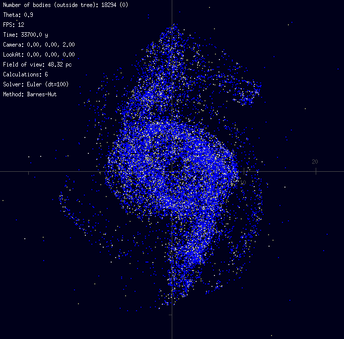

# Projet-N-corps : algorithmes et optimisation


## Introduction

Ce projet a été réalisé dans le cadre des projets d'initiation de MAIN3.

Il consiste a résoudre numériquement le problème à N-corps en effectuant le plus d'optimisation possible.
Ainsi, nous avons implémenté différents algorithme allant du calcul direct et naïf à l'algorithme de Barnes-Hut afin de comparer les performances de chacun.
Nous allons également étudier l'impact de la parallélisation sur les performances du programme.
Il nous est également important d'étudier l'aspect physique du problème afin d'avoir des simulations cohérentes, notamment pour pouvoir simuler des galaxies.

Nous avons travaillé à partir d'un code C++ comprenant déja toute la partie de visualisation et la base de la résolution du problème.

## Objectifs

- [x] Méthode de calcul directe
- [x] Méthode de calcul directe optimisée
- [x] Algorithme de Barnes-Hut
- [x] Parallélisation OpenMP
- [x] Etude comparative des performances
- [x] Rajouter un nouvel intégrateur
- [x] Coloration des particules
- [ ] Nouvelle initialisation

##  Prise en main

### executable main 
Le programme permet de saisir le nombre de particules à générer lors de la simulation.

Il est également nécessaire de choisir la méthode à utiliser :

1. Barnes-Hut (<25000 particules)
2. Naïve opitimisée (<2000 particules)
3. Naïve (<1000 particules)

Il est également possible de modifier les paramétres de la simulation directement dans le code afin de moduler la simulation.

### executable main_mesure
Le programme permet d'executer une simulation en passant directement le nombre de particules et le numéro de la méthode. 

Il permet également d'écrire dans les fichiers situés dans le dossier data les temps moyens mis par la méthode en question pour ce nombre de particules. Ainsi, ce code n'éxecute qu'un certain nombre d'itérations (par défaut 100) avant de se fermer.

### executable tests
Ce programme permet de lancer des séries des mesures de temps de calcul et de construction d'arbre pour les différentes méthodes et d'enregistrer les résultats dans des fichiers .txt exploitable par le script python ./data/analyse.py.

Pour réinitialiser les test, il faut supprimer les fichiers .txt.

### analyse.py
Ce script permet simplement d'afficher les résultats des différentes mesures.

## Commandes

- **L** : permet  de dézoomer
- **K** : permet de zoomer
- **T** : permet d'afficher l'arbre de Barnes-Hut
- **A** : permet d'afficher/cacher les graduations


## Dependencies

###  Sous Linux (Ubuntu)

### Bibliothèques graphiques

Pour la partie graphique, le programme repose sur la première version de la [SDL](https://www.libsdl.org/) et sur [OpenGL](https://www.opengl.org/).

Pour installer la SDL :
```
sudo apt install libsdl1.2-dev libsdl-ttf1.2-dev libsdl-gfx1.2-dev libsdl-gfx1.2-5 libsdl-ttf1.2
```

Pour installer les paquets complémentaires d'OpenGL :
```
sudo apt-get install freeglut3-dev
```

### Parallèlisation

La parallèlisation est réalisée à partir de la library [OpenMP](https://www.openmp.org/) qui est présente nativement avec le compilateur gcc.

## Install

```
make
```
 
## Visuels actuels

### Avec 26000 particules


### Avec 2 Trous Noirs et 20000 particules


### Galaxie spirale


## A corriger

- Fusion
